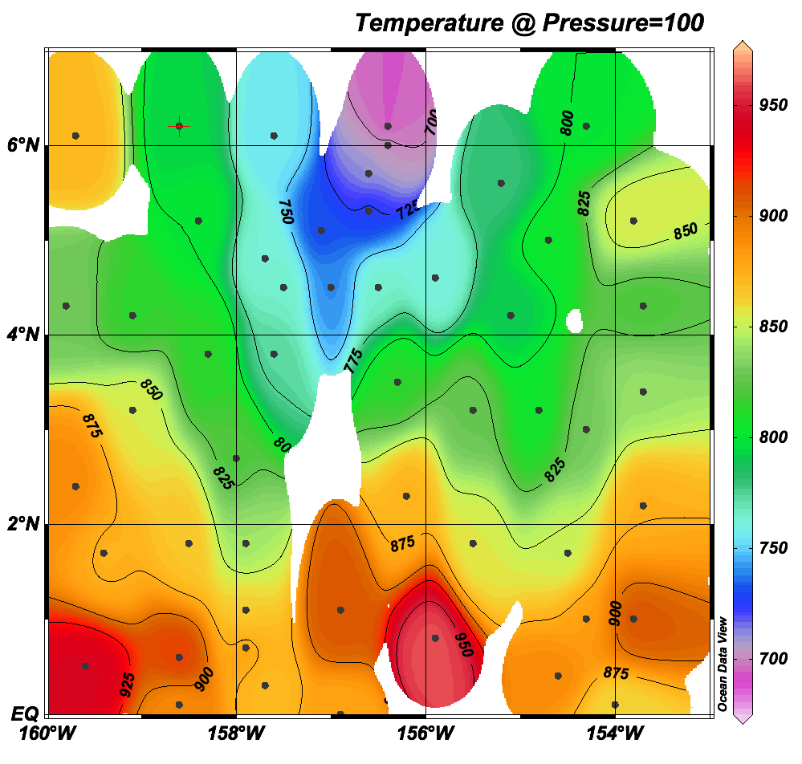

# Demonstrate gridding and contouring

Two methods are shown: (blue) a covariance-based method explained Modern
Applied Statistics with S-Plus (Venables and Ripley, 1999) and (red) the Barnes
iterative local-mean method.

```{r gridding,fig.path='figure/gridding_',fig.width=8,fig.height=8,dpi=100,fig.cap="**Gridding**"}
par(mar=c(2, 2, 1, 1), mgp=c(2, 0.7, 0))
library(oce)
library(spatial)
library(MASS)
## MASS suggested method
glsModel <- surf.gls(np=2, covmod=expcov, x=topo, d=1)
glow <- 0
ghigh <- 6.5
gn <- 100
glsPred <- prmat(glsModel, glow,ghigh,glow,ghigh,gn)
levels <- seq(0, 1000, 50)
contour(glsPred, levels=levels, labcex=0.7, col='blue')
points(topo$x, topo$y, pch=20)

## Barnes method
b <- interpBarnes(topo$x, topo$y, topo$z,
                  xg=seq(glow, ghigh, length.out=gn),
                  yg=seq(glow, ghigh, length.out=gn))
contour(b$xg, b$yg, b$zg, col="red",
        levels=levels, drawlabels=FALSE, add=TRUE)
```

For comparison, below is the result from ODV.  The steps to produce the graph are basically as follows.

1. Use an R script to make a fake dataset (``topo.txt`` in this directory.
Then, do the following in ODV.

2. Menu ``Import`` then Menu ``ODV Spreadsheet``, and then find the file and
click OK.

3. Box "Spradsheet file propeties": click OK

4. Box "Metadata": click OK

5. Box "Collection parameters" (I think): click OK

6. Box "Meta variable association" (I think): click OK

7. A step that I can't remember, to create temperature at isosurface 100m.  The
menu item may contain the word "derived".

8. Menu ``View`` then menu ``Isosurface values`` and find the temperature field
thus created.

9. In the window, right-click and find the template with a single surface.
This will make a new graph panel in addition to the existing map.

10. Right-click in the new panel and choose the z variable as the temperature field

11. Right-click in the new panel and set ranges for lat (0 to 7) and lon (200
to 207)

12. Right-click in the new panel and find something perhaps named "properties",
then click around until you see how to use colour and also contours.  This
takes a few steps.  Suggested contour values have to be copied from one box to
another, for example.

With steps like those above (and perhaps others) you'll get a window with the
original map and also the desired plot.  Below is what I got when I trimmed to
the latter.



