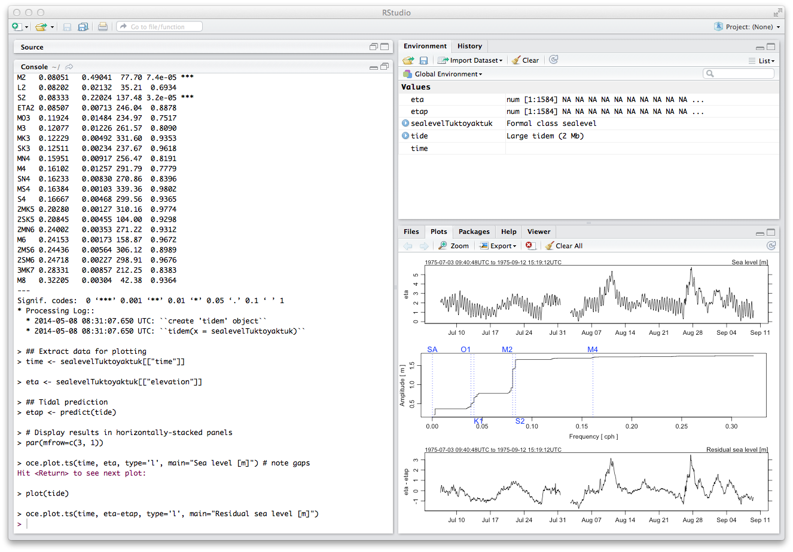

**sandbox/dk/01**

Idea -- DK could beef up some of the demo() items for oce.  Too little thought
has gone into these so far, with many of them amounting to ``data(x);plot(x)``
boilerplate.

For example, the ``demo(tide)`` example might be neat for CMOS.  It shows how
to fit a tidal model, which is useful to many people, and it uses the standard
dataset from Tuktoyaktuk (fun for Canadian content).  DK needs to check that it
gets coefficients similar to those from Mike Foreman though!!!

```{r}
## Tidal analysis of Tuktoyaktuk sea level
library(oce)
data(sealevelTuktoyaktuk)
## Tidal model fitted with tidem()
tide <- tidem(sealevelTuktoyaktuk)
summary(tide)
## Extract data for plotting
time <- sealevelTuktoyaktuk[["time"]]
eta <- sealevelTuktoyaktuk[["elevation"]]
## Tidal prediction
etap <- predict(tide)
# Display results in horizontally-stacked panels
par(mfrow=c(3, 1))
oce.plot.ts(time, eta, type='l', main="Sea level [m]") # note gaps
plot(tide)
oce.plot.ts(time, eta-etap, type='l', main="Residual sea level [m]")
```

The example shows:

* using built in datasets
* using tidem()
* using predict(), a *generic* function (a very important idea)
* using summary(), again a generic
* plotting time series with extra features like the time range

Ideas for making it live:

* turn off the time range
* change to columns
* ``table(is.na(eta))`` produces a very useful result with little effort
* ``fivenum(eta)`` again is useful
* ``hist(eta)``
* ``boxplot(eta)``



